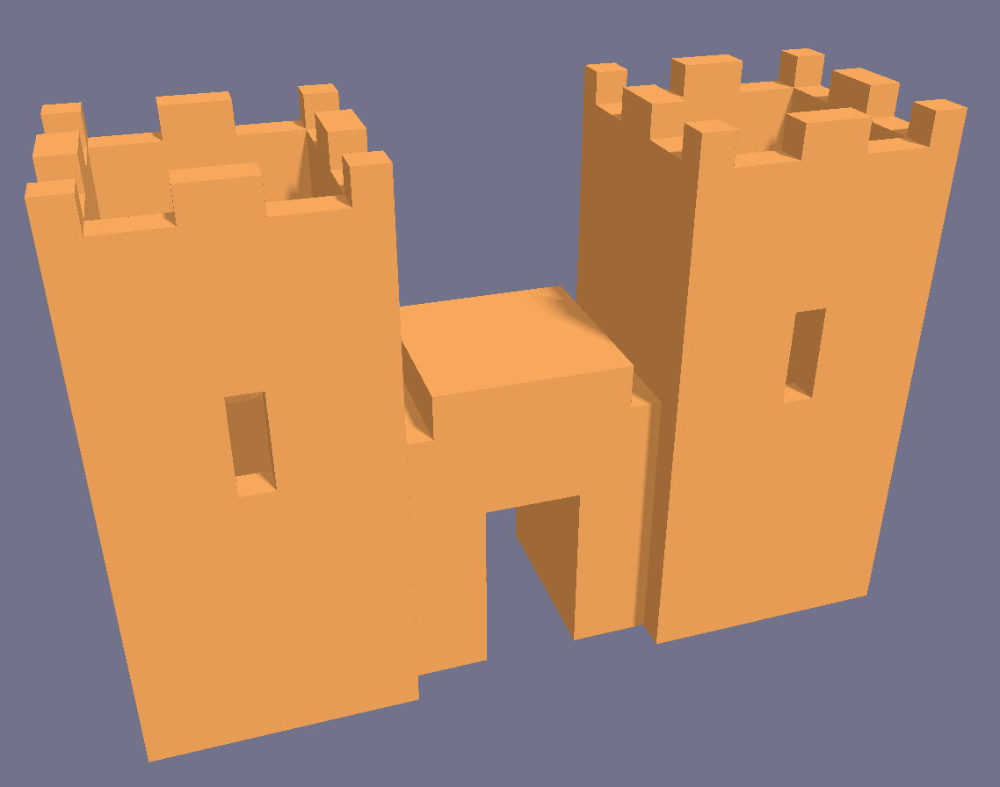
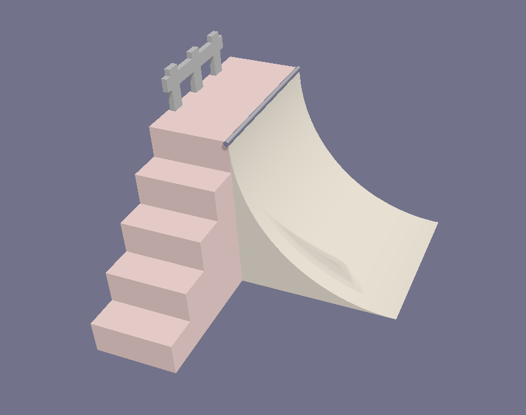
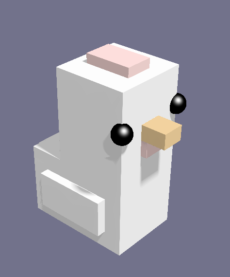
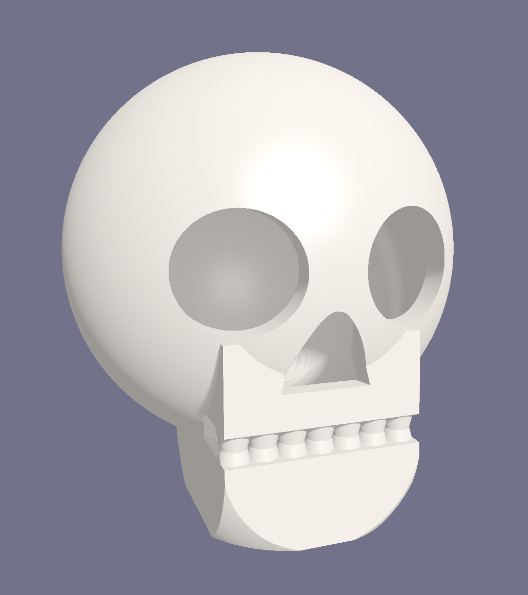

# 🏰 IronSmith


**IronSmith** is a Terminal-based 3D modeling scripting language. It allows you to build complex 3D shapes using code (Constructive Solid Geometry) and view the results instantly via a custom GPU-accelerated raymarching engine.

## 🚀 Features

* **Custom Scripting Language:** Write `.irsm` files using a clean, math-focused syntax.
* **TUI Editor:** A terminal user interface built in Haskell (`brick`) with syntax highlighting, a file manager, and error reporting.
* **Instant Hot-Reloading:** The moment you stop typing, the 3D viewer updates. No manual compilation required.
* **GPU Raymarching:** The renderer evaluates Signed Distance Fields (SDFs) natively on the GPU for perfectly smooth, mathematically accurate shapes.
* **Graceful Error Handling:** If you type a syntax error, the renderer catches the panic and holds the last working shape until you fix your code.

## 🏗️ Architecture

IronSmith is a monorepo utilizing two incredibly strict, high-performance languages communicating in real-time:

1. **The Forge (Haskell):** Acts as the orchestrator. It parses the custom `.irsm` language into an Abstract Syntax Tree (AST), evaluates variables, and compiles the result into optimized GLSL (OpenGL Shading Language) math. It also manages the lifecycle of the viewer process.
2. **The Viewer (Rust & wgpu):** A highly concurrent, cross-platform graphics window. It uses file-watching (`notify`) to detect incoming GLSL math from the Haskell compiler. It then wraps that math in a template, compiles the shader on the fly, and uses raymarching to render the SDFs to the screen.

## ⚙️ Prerequisites

To run IronSmith from source, you will need:
* **Haskell Toolchain:** GHC and Cabal
* **Rust Toolchain:** Cargo and `rustc`
* A GPU capable of Vulkan, Metal, or DX12.

## 🛠️ Quick Start

### Option A: Download the latest release (Windows)

Grab the prebuilt `IronSmith-v0.1.0-windows.zip` from the [Releases page](https://github.com/Fraser-Levack/IronSmith/releases), extract it, and run `ironsmith.exe` (or run `install.ps1` to add IronSmith to your PATH).

### Option B: Build from source

**1. Clone the repository:**
```bash
git clone [https://github.com/yourusername/IronSmith.git](https://github.com/yourusername/IronSmith.git)
cd IronSmith
```

**2. Build the Rust Viewer (Must be done first so Haskell can launch it):**


```bash
cd IronSmith-Viewer
cargo build --release
cd ..
```

**3. Run the Haskell TUI:**

```bash
cd IronSmith
cabal run ironsmith
```

## 📖 Language Syntax Overview
IronSmith supports basic primitives, transformations, and CSG (Constructive Solid Geometry) operations.

```Plaintext
// Variables
size = 5

// Primitives
cube(10, 10, 10)
sphere(size, 16)
cylinder(radius, definition, height)
cone(radius, top_radius, definition, height)
torus(radius, tube_radius, definition)

// Transformations
move(x, y, z, shape)
rotateX(degrees, shape)
rotateY(degrees, shape)
rotateZ(degrees, shape)

// CSG Operations (Union, Difference, Intersection)
difference(
    cube(10, 10, 10), 
    sphere(6, 16)
)

// Materials and Paints
paint(color, shape) // color is a hex code (e.g., "#FF5733")

material(type, shape) // type can be "metal", "plastic", "matte", "neon"

// Lighting (optional; the last light statement wins)
light(10, 20, 5)        // directional light shining from (10, 20, 5) toward the origin
light(10, 20, 5, 0.4)   // same, with intensity 0.4 (default 1.0)

// Camera animation keyframes: camera(time, yaw, pitch, dist [, x, y, z])
// Two or more keyframes define a looping camera path (angles in degrees;
// the optional x, y, z is the point the camera looks at, default origin).
camera(0, 0, 20, 25)
camera(4, 360, 20, 25)  // a 4-second full turntable orbit
```

Pair a dim `light(...)` with the `exposure` setting in `ironsmith.toml` (Ctrl+G) to fine-tune viewport brightness.

## 🎬 Animation & Video Export

Add `camera(...)` keyframes to a script and press `Ctrl+A` to play the camera path as a smooth loop in the viewer (press again to stop). The animation hot-reloads with the rest of the script as you type.

Press `Ctrl+Shift+V` to export the animation as a video next to your `.irsm` file:

* With **ffmpeg** on your PATH you get an `.mp4` (best quality).
* Without it, IronSmith writes an animated `.gif` — no extra installs needed.

Frames are rendered offline at a fixed timestep (`video_fps` in `ironsmith.toml`, default 30), so the output is perfectly smooth regardless of GPU speed, and the active post-process filter is baked in — an `ascii`-filtered flythrough exports exactly as you see it. The viewer window title shows export progress.

## 🎨 Filters (Moddable Post-Processing)

IronSmith's viewport is moddable: the renderer applies a user-editable GLSL **filter** on top of the scene every frame. On first launch the viewer creates a `filters/` folder in your IronSmith config directory (`%APPDATA%\ironsmith\filters` on Windows, `~/.config/ironsmith/filters` on Linux/macOS) containing the built-in examples:

* **`edge_detection`** — Sobel edges: glowing outlines over a dimmed scene
* **`heatmap`** — thermal-camera look mapping brightness to a cold→hot ramp
* **`ascii`** — redraws the model as live text that morphs in real time
* **`passthrough`** — the identity filter, fully commented as a template for your own

**Switching filters:** press `Ctrl+F` in the editor to cycle through every filter in the folder (plus "none"), or set a default in your settings (`Ctrl+G`):

```toml
[viewer]
filter = ascii
```

**Writing your own:** copy `passthrough.glsl`, rename it, and define one function:

```glsl
vec4 apply(vec2 uv) {
    // scene(uv)    -> vec4  the rendered scene at uv (0..1)
    // luma(rgb)    -> float perceptual brightness
    // u_resolution -> vec2  window size in pixels
    // u_time       -> float seconds since launch
    return scene(uv);
}
```

Drop the file in the folder and it's instantly part of the `Ctrl+F` cycle. Filters are compiled with the same panic-safe pipeline as models — a broken filter never crashes the viewer, it just keeps the last working one.

## 🚩 Recently Made Demo models

<p align="center">
  
  
  
  
</p>

## 🗺️ Roadmap / Future Work
[x] Basic primitive parsing and rendering

[x] Cross-process hot-reloading

[x] Panic-free GPU fallback shaders

[x] Free-flight camera controls

[x] Material and color parsing

[x] Exporting generated SDFs to .obj meshes

[x] Camera animation keyframes with looping playback

[x] Exporting animations to video (.mp4 via ffmpeg, .gif built-in)

[ ] Animating object transforms (move/rotate/scale over time)


## 🤝 Contributing

IronSmith is an open-source forge, and contributions of any size are highly appreciated! Whether you're fixing a typo, optimizing the raymarching engine, or extending the Haskell parser, we'd love your help.

### How to Contribute

1. **Fork the repository**
2. **Create a new branch:** `git checkout -b feature/your-awesome-feature`
3. **Make your changes** (Be sure to test both the Haskell TUI and the Rust Viewer if your feature bridges both!)
4. **Commit your changes:** `git commit -m "Add some awesome feature"`
5. **Push to the branch:** `git push origin feature/your-awesome-feature`
6. **Open a Pull Request**

### Areas We Need Help With
* **Graphics (Rust):** Implementing material and color parsing in the GLSL generation.
* **Language (Haskell):** Adding variables, looping constructs, or new primitives to the `.irsm` language.
* **Tooling:** Exporting evaluated SDFs to standard 3D formats (`.obj` or `.stl`).
* **Quality of Life:** Expanding the Rust viewer to include more controls.

### Development Guidelines
* **Haskell:** Please ensure your code compiles cleanly. Running your code through standard linters like `hlint` is highly encouraged.
* **Rust:** Keep the viewer blazing fast and safe. Please run `cargo fmt` and `cargo clippy` before submitting a PR to maintain code quality.

## ✨ Contributors

* **Fraser W Levack** - *Creator & Lead Developer* - [@Fraser-Levack](https://github.com/Fraser-Levack)

*(Want to see your name here? Check out the section and open a PR!)*

## 📄 License
This project is licensed under the MIT License - see the [LICENSE](LICENCE) file for details.
